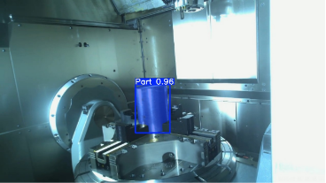

during the summer 2025 I worked at GKN Aerospace GTC in Trollhättan Sweden.
After discussions with the people there the plan for my project ended up
being a combination of three other emplyees ideas.
- Experiment with segmentation in computer vision
- Create an interface for a new Rotoclear camera
- Make it possible to monitor the production process from outside the shop floor

## Problem
A quick Google search will show the many domains GKN is involved in: space, commercial aviation, and defense.
Because of this, they are very strict about what can and cannot be shown. The current issue is that there is no way to view machine operations from outside the shop floor due to IP-protected parts.

However, if there were a way to hide or obscure the actual part being manufactured, it could make it possible to install screens in the offices to monitor production progress.

This is where my project came in: to create a proof-of-concept (PoC) application that takes an RTSP stream and blurs the part in real time.

(_Fun fact: 90% of all the commerical planes in the sky have GKN parts on it_)

# MORE TO COME

## What I learnt