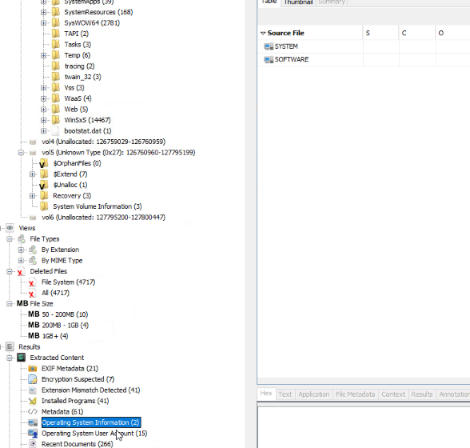
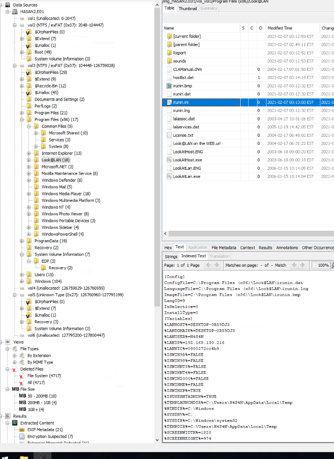
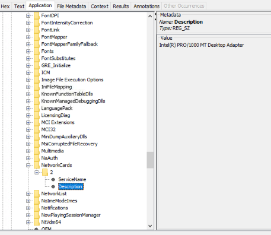
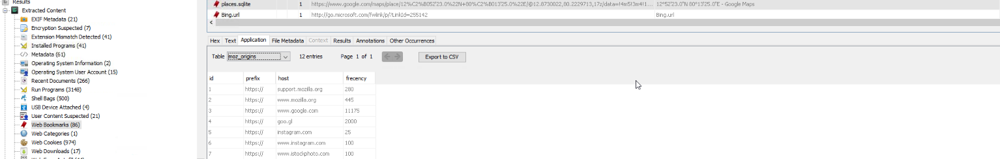
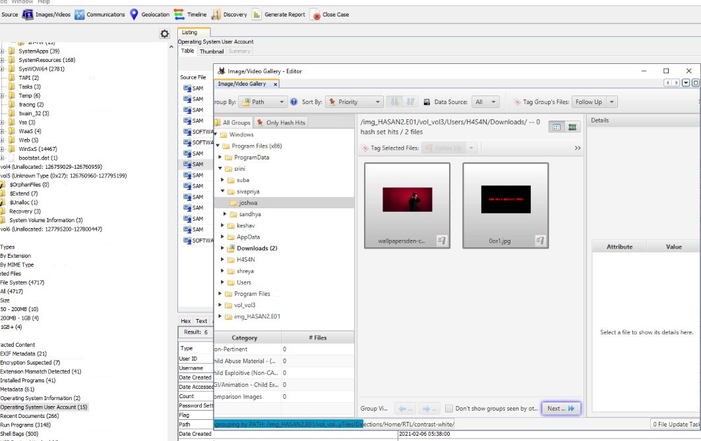
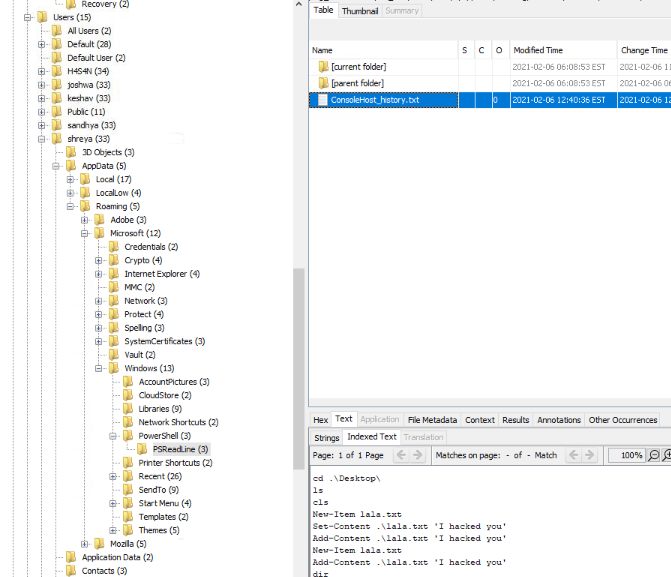
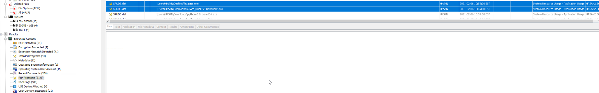
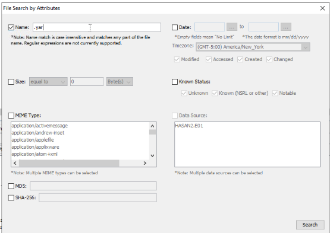
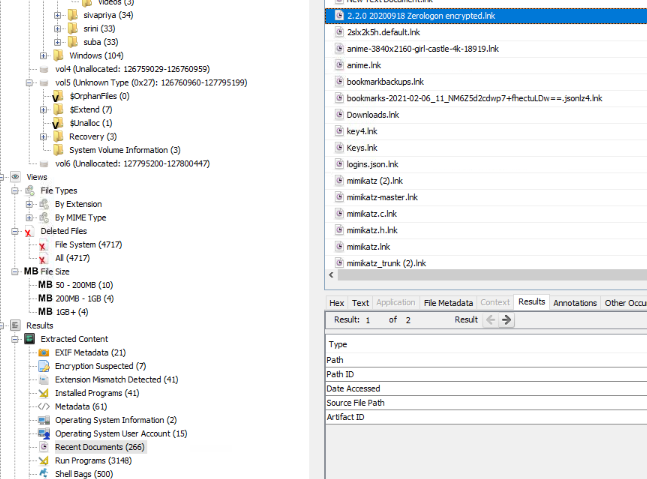

## Overview

Machine is a medium-difficulty windows box. It involves using autopsy which is a digital forensics software. First time using Auyopsy so it was a bit fuck around and find out but its essentialy like looking through a windows machine file explorer.

### Overview of files provided

## Flags

### Flag 1
_What is the MD5 hash of the E01 image?_

***ANSWER:*** 3f08c518adb3b5c1359849657a9b2079

In the provided files you have the text document for the _"HASAN2.EO1"_ that proved general information about the EO1 file. MD5 checksum is provided here

### Flag 2
_What is the computer account name?_

***ANSWER:*** DESKTOP-0R59DJ3

In the _"Operating System Information"_ (left hierarchy) you'll find the source file _"SYSTEM"_ that states the PC name.

### Flag 3
_List all the user accounts. (alphabetical order)_

Just below the _"Operating System Ifomration"_ from the previous question you have the _"Operating System User Account"_. Windows users are in the "SAM" so skipping the different default windows users and going with the other SAM accounts youäll have the third flag.

***ANSWER:*** H4S4N,joshwa,keshav,sandhya,shreya,sivapriya,srini,suba

### Flag 4
_Who was the last user to log into the computer?_

In the same page as the third question you can order _"Data accessed"_ and then find the most recent user logged in.

***ANSWER:*** sivapriya

### Flag 5 and 6

The IP can usually be founf in the windows registry but this did not show any for me so I needed too look somewhere else. After some googling and looking around in the autopsy image I found a network monitoring tool _"Look@Lan"_ and reading its init file that shows both the IP and the MAC address.

***Q5:*** _What was the IP address of the computer?_

***ANSWER(5):*** 192.168.130.216

***Q6:*** _What was the MAC address of the computer? (XX-XX-XX-XX-XX-XX)_

***ANSWER(6):*** 08-00-27-2c-c4-b9

### Flag 7
_What is the name of the network card on this computer?_

Looking through the system registry you can find most information about the host itself so always when you can't find something look in the registry if you are working on some forensics on a windows host. 
The network card can be foudn in the registry _SOFTWARE\Microsoft\Windows NT\CurrentVersion\NetworkCards_.

***ANSWER:*** Intel(R) PRO/1000 MT Desktop Adapter

### Flag 8
_What is the name of the network monitoring tool?_

From the IP and Mac address question above I took a chance and guessed since I knew _Look@Lan_ is a network monitoring tool and it was the correct answer. 

***ANSWER:*** Look@LAN

### Flag 9
_A user bookmarked a Google Maps location. What are the coordinates of the location?_

Looking through the _"Web Bookmarks"_ and scrolling through the different bookmarks it wasn't hard finding something that looked like coordinates.

***ANSWER:*** 12°52'23.0"N 80°13'25.0"E

### Flag 10
_A user has his full name printed on his desktop wallpaper. What is the user's full name?_

In the top bar you have a _"Images/Videos"_ that showcases all the extracted images from the host machine. Then all you need to do is to go though the different users images and on one of the images you can see a name in the top left corner.

***ANSWER:*** Anto Joshwa

### Flag 11
_A user had a file on her desktop. It had a flag but she changed the flag using PowerShell. What was the first flag?_
I forgot to take an image of this but you can see powershell history in users: 
_"APPDATA\Microsoft\Windows\PowerShell\PSReadLine\ConsoleHost_history.txt"_ file and checking the different users ít can be found that the user _shreya_ changed _flag{HarleyQuinnForQueen}_ to _flag{I-hacked-you_
}

***ANSWER:*** flag{HarleyQuinnForQueen}

### Flag 12
_The same user found an exploit to escalate privileges on the computer. What was the message to the device owner?_

The same user as the previous question you can just check the same file and find the flag the user change it to. There are also a _.ps1_ powershell file that shows the PRivilage escelation attempt but this was not needed because of the powershell history.

***ANSWER:*** flag{I-hacked-you}

### Flag 13
_2 hack tools focused on passwords were found in the system. What are the names of these tools? (alphabetical order)_

Going through _"Run Program"_ I found quite quickly the two password tools just because I have previous experience with them. Mimikatz extracts password hashes and Lazagne shows passwords stored on the system.

[Mimikatz](https://github.com/ParrotSec/mimikatz)
[Lazagne](https://github.com/AlessandroZ/LaZagne) 

***ANSWER:*** Lazagne,Mimikatz

### Flag 14
_There is a YARA file on the computer. Inspect the file. What is the name of the author?_

Searching for a files by attributes you can search for _".yar"_  and 3 files will be provided´. in the _"kiwi_passwords.yar"_ the document author can be found at the top.

***ANSWER:*** Benjamin DELPY (gentilkiwi)

### Flag 15
_One of the users wanted to exploit a domain controller with an MS-NRPC based exploit. What is the filename of the archive that you found? (include the spaces in your answer)_

I did have a hard time with this one however I decided to look for "installed programs" with spaces but nothing, then I tried "Run programs" but also nothing came up. After checking the "Recent Documents" and looking for names with spaces I found a file a weird name and after a quick google search for _"Zerologon"_ I realized that it was the correct file.

***ANSWER:*** 2.2.0 20200918 Zerologon encrypted.zip

